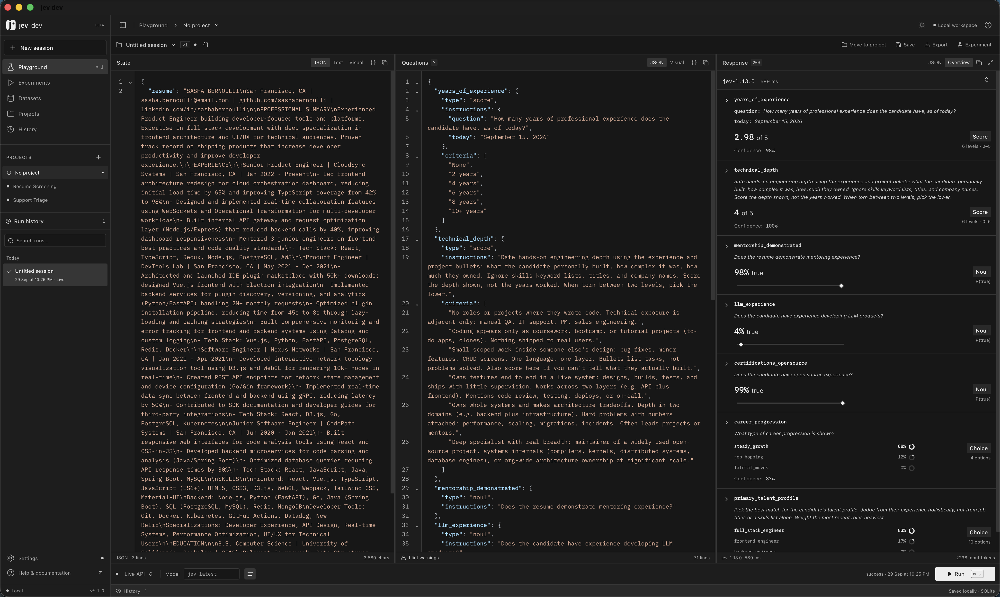

# jev dev

A local-first desktop workbench for experimenting with Jev.



## Install

Download the installers from the [latest release](https://github.com/donvito/jev-dev/releases/latest).

| Platform | Package |
| --- | --- |
| macOS, Apple Silicon or Intel | Universal `.dmg` |
| Windows, x64 | `windows-x64-setup.exe` or `windows-x64.msi` |
| Linux, x86_64 | `linux-amd64.deb` for Debian/Ubuntu, or `linux-x64.AppImage` |

On Debian/Ubuntu, install the downloaded package with `sudo apt install ./jev-dev_0.1.1_linux-amd64.deb`. To run the AppImage:

```sh
chmod +x jev-dev_0.1.1_linux-x64.AppImage
./jev-dev_0.1.1_linux-x64.AppImage
```

Linux packages are built on Ubuntu 22.04. The Debian package installs its WebKitGTK 4.1 dependencies; AppImage bundles them. Use an active desktop D-Bus session. Saving an API key requires a running Secret Service provider, such as GNOME Keyring. Demo mode works without a key. If AppImage reports a missing FUSE library, use the [AppImage FUSE guide](https://docs.appimage.org/user-guide/troubleshooting/fuse.html), or run it with `--appimage-extract-and-run`.

Windows installers set up WebView2 if it is missing; that step requires internet access. Windows installers are unsigned. The macOS build is not Developer ID signed or notarized.

## Prerequisites

- Node.js 22.12+ and npm
- Rust 1.88+
- [Tauri prerequisites for your OS](https://v2.tauri.app/start/prerequisites/) (including Xcode Command Line Tools on macOS)

On Windows, install Microsoft C++ Build Tools with **Desktop development with C++**, WebView2, and the MSVC Rust toolchain. Building an MSI also requires the VBSCRIPT optional feature.

On Debian/Ubuntu, install the native build dependencies:

```sh
sudo apt update
sudo apt install build-essential curl wget file pkg-config libwebkit2gtk-4.1-dev \
  libxdo-dev libssl-dev libayatana-appindicator3-dev librsvg2-dev libdbus-1-dev \
  patchelf xdg-utils
```

## Run

```sh
git clone https://github.com/donvito/jev-dev.git
cd jev-dev
npm ci
npm run desktop
```

For live requests, save a [TypeSafe API key](https://console.typesafe.ai/) in **Settings** and select **Live API**. **Demo** works without a key.

Optional browser preview:

```sh
npm run dev
```

Open <http://127.0.0.1:1420>. The browser preview is demo-only; live API requests require the desktop app.

## Build

```sh
npm run tauri -- build
```

Build the packages for the host operating system:

```sh
# Windows (run on Windows)
npm run tauri -- build --ci --bundles nsis,msi -- --locked

# Linux (run on Linux)
npm run tauri -- build --ci --bundles appimage,deb -- --locked

# macOS, both Apple Silicon and Intel
rustup target add aarch64-apple-darwin x86_64-apple-darwin
npm run tauri -- build --ci --target universal-apple-darwin --bundles app,dmg -- --locked
```

Desktop bundles are written to `src-tauri/target/release/bundle/`, or `src-tauri/target/<target>/release/bundle/` when a target is specified. On macOS, the app bundle is named `jev dev.app`.

For a debug bundle, use `npm run tauri -- build --debug`; output goes to `src-tauri/target/debug/bundle/`.

To build only the frontend, run `npm run build`; output goes to `dist/`.

The [desktop build workflow](.github/workflows/desktop-builds.yml) runs frontend checks, frontend and Rust tests, native Windows/Linux builds, and credential-storage and installer startup checks. Its artifacts include the installers, SHA-256 checksums, and a manifest identifying the source commit. To rebuild a release, manually run the workflow with its existing tag (for example, `v0.1.1`); the workflow checks out that exact tag and verifies its version before building.
